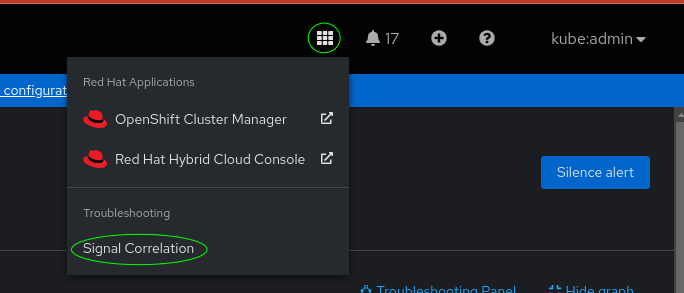

= Troubleshooting Panel User Guide
:doctype: book
:toc: left

The troubleshooting panel displays a graph of resources and observability signals related to whatever is 
shown in the main console window.
Nodes in the graph represent a type of resource or signal, edges represent relationships.

Clicking on a node in the graph opens the console page showing details of that resource or signal.
Clicking the "Focus" button re-calculates the graph starting from the current contents of the main window.

The panel provides a map of related information to help you navigate more quickly to relevant data,
or to discover relevant data you may not have been aware of.

We will show an example of troubleshooting an Alert.

NOTE: You can re-create this example alert on your own cluster by following the instructions xref:example-alert[here].
You can also experiment by using the panel with existing resources in your own cluster.

== Opening the panel

Open the troubleshooting panel with the "Signal Correlation" entry in the troubleshooting section of
the "launcher" menu, found at top right of the screen:

[.border]

Opening the panel shows a _neighbourhood_ of the resource currently displayed in the console.
A neighbourhood is a graph that starts at the current resource, and includes related objects up to
3 steps away from the starting point.

NOTE: Not all resource types are currently supported, more will be added in future.
For an unsupported resource, the panel will be empty.

For example here the panel for a `KubeContainerWaiting` alert.

[.border]
image::images/panel-graph.png[]

<1> Alert(1): This node represents the starting point, a `KubeContainerWaiting` alert that was displayed in the console.
<2> Pod(1): This node indicates there is a single Pod resource associated with this alert. Clicking on this node will show the pod details in the console.
<3> Event(2): There are two kuberenetes events associated with the Pod, and you can see them by clicking this node.
<3> Logs(74): The pod has emitted 74 lines of logs. Click to show them.
<4> Metrics(105): There are always many metrics associated with every Pod.
<6> Network(6): There are network events associated with the pod, which means it has communicated with other resources in the cluster.
    The remaining Service, Deployment and DaemonSet nodes are the resources that the pod has communicated with.
<7> Focus: Clicking this button will re-calculate the graph starting from the current contents of the main console window.
    This may have changed by clicking nodes in the graph, or by using any other links, menus or navigation features of the console.
<8> Show Query: enables experimental features detailed below.

NOTE: Clicking on a node may sometimes show fewer results than are indicated on the graph.
This is a known issue that will be addressed in future.

== Experimental features

[.border]
image::images/query-details.png[]

<1> Hide Query hides the experimental features.
<2> The query that identifies the starting point for the graph. This is normally derived automatically from the contents of the main console window.
    You can enter queries manually, but the format of this query language is experimental and likely to change in future.
    footnote:[This query language is part of https://korrel8r.github.io/korrel8r[Korrel8r], the correlation engine used to create the graphs]
    The "Focus" button updates the query to match the resources in the main console window.
<3> Neighbourhood depth: increase or decrease to see a smaller or larger neighbourhood.
    Note: setting a large value in a large cluster may cause the query to fail if the number of results is too big.
<4> Goal class: Selecting this option will do a _goal directed search_ instead of a neighbourhood search.
    A goal directed search will show all paths from the starting point to the goal _class_ , which indicates a type of resource or signal.

The format of the goal class is experimental and may change. Currently the valid goal classes are:

[horizontal]
`k8s:__resource[.version.[group]]__` ::  Kind of Kuberenetes resource. For example `k8s:Pod` or `k8s:Deployment.apps.v1`.
`alert:alert`:: Any alert.
`metric:metric`:: Any metric.
`netflow:network`:: Any network observability event.
`log:__log_type__`:: Stored logs,  __log_type__ must be `application`, `infrastructure` or `audit`

== Optional signal stores

The troubleshooting panel relies on the observability signal stores installed in your cluster.
Kuberenetes resources, alerts and metrics are available by default in an OCP cluster.

Other types of signal require optional components to be installed:

- Logs: "Red Hat Openshift Logging" (collection) and "Loki Operator provided by Red Hat" (store)
- Network Events:  "Network Observability provided by Red Hat"  (collection) and "Loki Operator provided by Red Hat" (store)

== Creating the example alert
[id="example-alert"]

You can reproduce the example alert shown above as follows.

.Procedure

. Run the following command to create a broken deployment in a system namespace:
+
[source,terminal]
----
kubectl apply -f - << EOF
apiVersion: apps/v1
kind: Deployment
metadata:
  name: bad-deployment
  namespace: default <1>
spec:
  selector:
    matchLabels:
      app: bad-deployment
  template:
    metadata:
      labels:
        app: bad-deployment
    spec:
      containers: <2>
      - name: bad-deployment
      	image: quay.io/openshift-logging/vector:5.8
----
<1> The deployment must be in a system namespace (such as `default`) to cause the desired alerts.
<2> This container deliberately tries to start a `vector` server with no configuration file. The server will log a few messages, and then exit with an error. Any container could be used for this.

. View the alerts:
.. Go to *Observe* -> *Alerting* and click *clear all filters*. View the `Pending` alerts.
+
[IMPORTANT]
====
Alerts first appear in the `Pending` state. They do not start `Firing` until the container has been crashing for some time. By showing `Pending` alerts you can see them much more quickly.
====
.. Look for `KubeContainerWaiting`, `KubePodCrashLooping`, or `KubePodNotReady` alerts.
.. Select one such alert and open the troubleshooting panel, or click the "Focus" button if it is already open.
